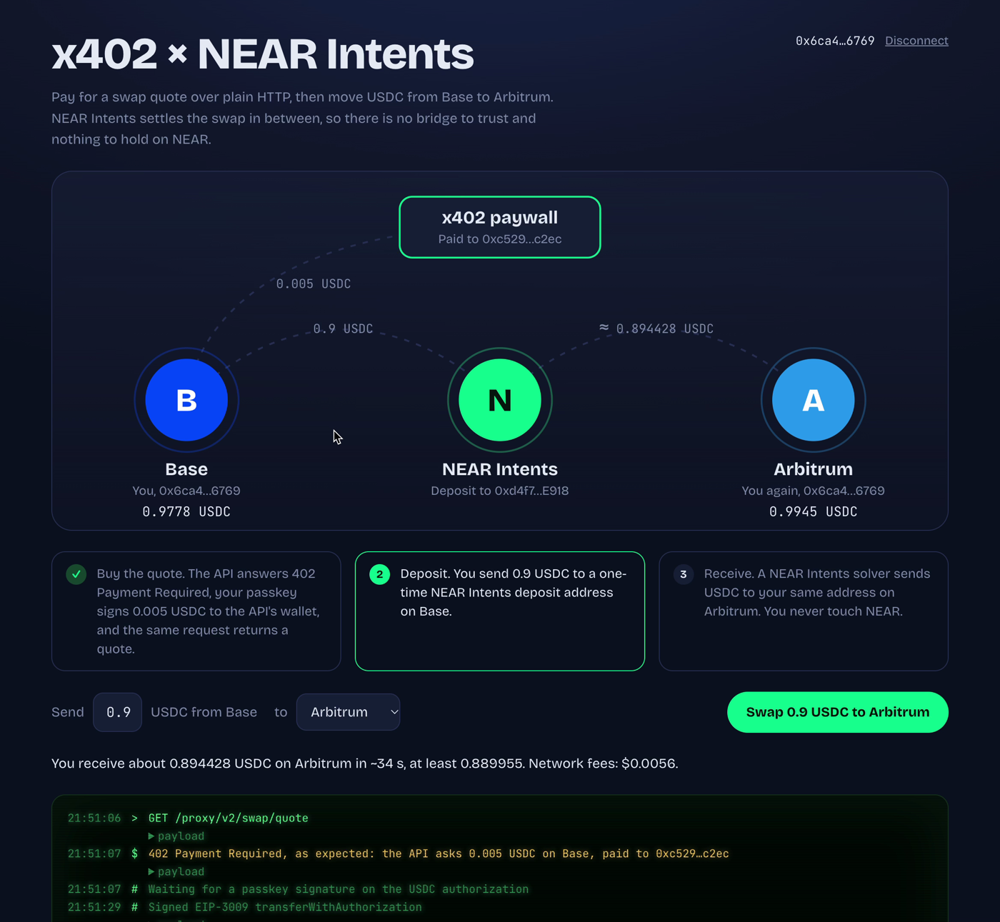

# x402 × NEAR Intents demo

A web app that pays for a cross-chain swap quote over [x402](https://github.com/x402-foundation/x402) and settles the swap through NEAR Intents. The wallet is a [JAW.id](https://jaw.id) smart account that signs with a passkey.



The flow, all on mainnet:

1. The app asks the JAW.id API for a swap quote (`GET /proxy/v2/swap/quote`).
2. The API answers `402 Payment Required` and asks for 0.005 USDC on Base.
3. The passkey signs an EIP-3009 `transferWithAuthorization`, and the app repeats the same request with the `PAYMENT-SIGNATURE` header. The facilitator settles the payment and the API returns the quote.
4. The app sends USDC to the one-time NEAR Intents deposit address from the quote.
5. A NEAR Intents solver delivers USDC to the same address on the destination chain, while the app polls the deposit status.

## Videos

- [`media/demo-explainer.mp4`](media/demo-explainer.mp4): 55 second walkthrough with captions per step, zooms on the console and the network diagram, and the waiting parts sped up.
- [`media/demo-recording.mp4`](media/demo-recording.mp4): the same run as a plain screen recording, trimmed to the flow, with only the NEAR Intents wait sped up.

- [`media/agent-demo.mp4`](media/agent-demo.mp4): 47 second cut of an AI agent doing the same swap on its own, described below.

The first two show a real run of 0.9 USDC from Base to Arbitrum, and the agent video a run of 0.5 USDC.

## Let an agent do it

x402 is built for software that pays for itself, so the same flow also runs with no app and no clicks. The [JAW.id CLI](https://www.npmjs.com/package/@jaw.id/cli) exposes the wallet to any MCP agent, and a session permission caps what the agent can spend.

Create the session once. This is the only step that needs your passkey:

```bash
npx @jaw.id/cli session setup --chain 8453 --x402 --limit 3/day
```

The permission allows USDC transfers on Base and nothing else, up to 3 USDC per day, for 7 days. Paying for the quote and sending the deposit are both USDC transfers, so the agent can do the whole swap inside that budget, and it cannot raise the cap. Revoke it with `npx @jaw.id/cli session revoke`.

Then start an agent in [`agent/`](agent), which registers the JAW.id MCP server in `.mcp.json`, and give it the request in [`agent/PROMPT.md`](agent/PROMPT.md). The agent finds the swap service in the x402 Bazaar with `jaw_discover`, pays for the quote with `jaw_pay_and_fetch`, sends the deposit with `jaw_rpc` using the session key, and tracks the deposit until it settles.

## Run it

```bash
pnpm install
cp .env.example .env.local   # add your JAW.id API key
pnpm dev                     # serves https://localhost:3000
```

The dev server runs over HTTPS because the JAW.id SDK only opens its embedded dialog on secure origins. The account needs USDC on Base for the quote and the swap, plus a little ETH for gas, and it has to be deployed on Base before USDC can verify its signature. The app offers an activation step when it is not.

Supported destinations: Arbitrum, Optimism, Polygon, Ethereum and BNB Chain.
